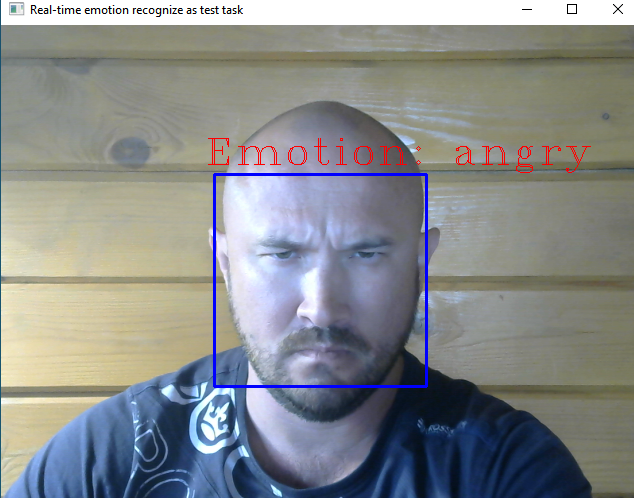
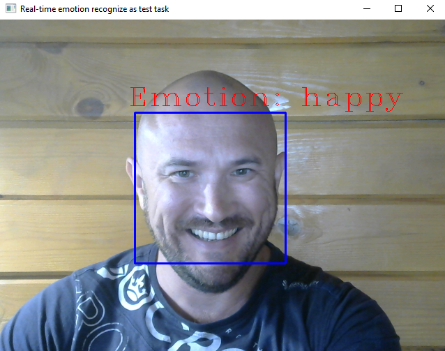

Постановка задания:

Необходимо на основе OpenCV(https://opencv.org/) сделать нейросеть с функцией определения эмоции(человек/собака/кошка и т.п.)прямого видеопотока.
Далее ссылку на гитхаб присылайте для проверки.

Мои комментарии:

вообще задание немного странное, так как OpenCV это не фреймворк для создания нейросетей, а скорее как либа обработки фото и видео

вот тут можно было обучить нейросеть на этих данных  https://www.kaggle.com/datasets/jonathanoheix/face-expression-recognition-dataset/

я взял готовую, так как обучать долго, а надо цигель цигель

Подтверждения работоспособности проги:

Тест сердитости:

От улыбки станет всем теплей — И слону и даже маленькой улитке!:

